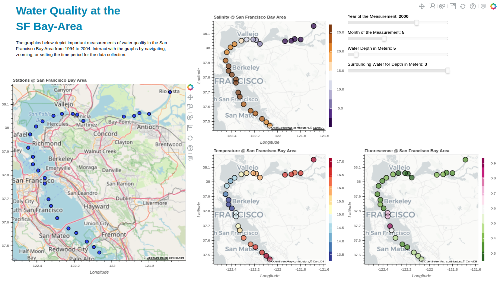

# Interactive Dashboard for Analyzing Water Quality of The Bay Area
## inf-viz-grp8-W20

This application was created as an assignment for the course: 188.308 Informationsvisualisierung (UE 1,0) 2020W @ TU Wien
[Link to TISS Lecture](https://tiss.tuwien.ac.at/course/courseDetails.xhtml?dswid=3687&dsrid=241&courseNr=188308&semester=2020W)

The application is an interactive dashboard, which aims to enable an easy and agile way to analyze water quality data of waters of San Francisco and its surroundings.
It is written in Python using the Bokeh library and can be used in any browser.

## Deployment

1. Clone the repository  
2. Create a conda environment and activate it (Optional)  
`conda create -y -n inf-viz python==3.7.7`  
   `conda activate inf-viz`  
3. Install dependencies  
`conda install pandas`  
`conda install -v bokeh==2.2.3`  
4. Navigate to the repository  
`cd path/to/inf-viz-grp8-w20`  
5. Run the application with Bokeh  
`bokeh serve sfbay-analytics.py`  
6. Open the running app in your browser  
`brave-browser http://localhost:5006/sfbay-analytics`  

## Data
We used the publicly available sensor-data of USGS:
[Bay Area Water Data](https://sfbay.wr.usgs.gov/access/wqdata/index.html)

The data which is used by the application is pre-processed by the `sfbay-preprocessing.py` script and stored as `data/sfbay_final.csv`. The data can be regenerated by simply running the script.

### Authors
[Dario Bogenreiter](https://github.com/dario-bo)  
[Peter Bognar](https://github.com/bognarpeter)    

